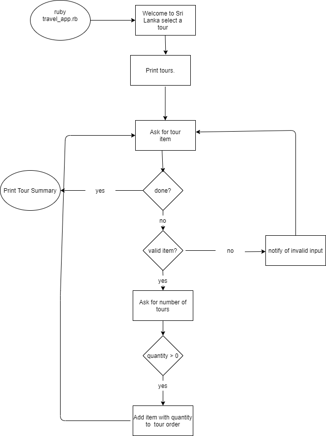
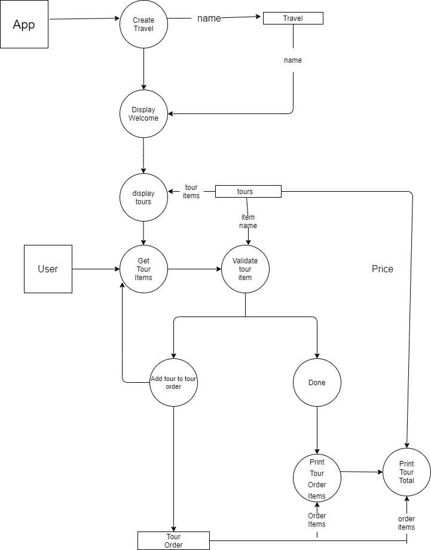

# HashiePussegoda_T1A3

Travel App for Ruby Terminal Assignment  

[Repository](https://github.com/Devbreaker29/HashiePussegoda_T1A3)

## Software Development Plan

### Purpose and Scope of Application

This is a Travel App which will match people to tours of their interest in Sri Lanka. The App starts by asking them what tour they would like and then appealing to a range of interests, offering a list of tours. Then the application asks the user to select tours and add number of tours needed. When tours are selected the user is asked to enter ‘done’ and then the App prints the tour summary.

This application will solve a much needed problem which is matching travellers with niche tours that cater to their interests in Sri Lanka. 

Customers can read the tours available in the Travel App and choose a tour or tours and add a number of tours they want from each tour. Once they have done that, they have an option to enter 'done' which will print their tour order summary with prices and totals.

### Features

#### Variables and Variable Scope
There are various classes in the terminal app which define the variables and ensure that the tests have been passed and the app is running. The classes are for the categories of Travel, Tours, TourItem and TourOrder and define the methods and the variables and provide indepth functioning for the app.  
#### loops and conditional control structures
A loop was made in the Travel App under ruby_travel.rb. The purpose of the loop was to print a message "Would you like a tour? When you are finished type 'done'." and then enable the user to type done. This loop along with another loop which was an If statement was done to allow the user choose tours and otherwise type 'done’. ‘Done’ ends the circle of choosing a tour or not selecting any tours. The loops were made to conviniently make the user click done when making and order and enabled the user to keep ordering any number of tours until enter the word ‘done’. 
#### write and utilise simple functions

The describe function is used to pass and write tests, this along with classes are very important in terms of passing tests. The describe function goes in depth of each test and goes in detail for each test and with creation of classes and methods help pass the test.  
### User Interaction

#### How the user will find out how to interact with / use each feature
When starting the app it gives a welcome message and a list of tours available on offer. Then the user is asked to choose tours. When one tour is selected it asks how many number of tours needed. Then once the numbers have been entered, it asks again whether you need to choose another tour. User can choose more tours and add more numbers of tours until he types ‘done’. When ‘done’ is entered application prints a tour summary with all the tours ordered and the total dollar value.

#### How the user will interact with / use each feature

The user will interact with each feature by running each test using the rspec gem. The way you navigate the terminal app is that you type the tour or tours you want and type done, then it prints the total price.

#### how errors will be handled by the application and displayed to the user

Errors will be handled in the sense that if the user type an incorrect tour name or a letter rather a number for  tour numbers, the tour summary gives total as zero.  
### diagrams

### Implementation Plan

Have to run tests using rspec.

Have to write tests for each class.

Need a file where you can run the file and the terminal app.

Need to run loops.

Need to run command line arguments and options to put input.

Need to make a script to run app.

Need to tell people how to run my app.

### How to install the application?

Download on Github.

Open in VSCode.

cd to appropriate file.

Then type ruby ruby_travel.rb.

